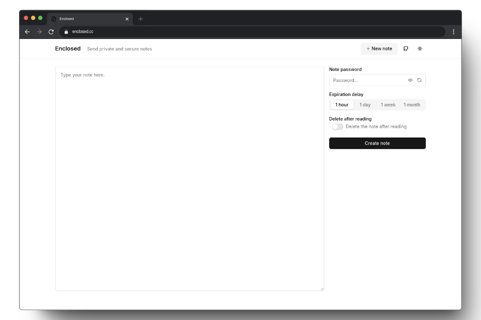

# Enclosed - Send private and secure notes
[Demo](https://enclosed.cc) &nbsp;&nbsp;-&nbsp;&nbsp; [Docs](https://docs.enclosed.cc) &nbsp;&nbsp;-&nbsp;&nbsp; [CLI](https://www.npmjs.com/package/@enclosed/cli) &nbsp;&nbsp;-&nbsp;&nbsp; [Self-hosting](https://docs.enclosed.cc/self-hosting/docker)

**Enclosed** is a minimalistic web application designed for sending private and secure notes.

All notes are end-to-end encrypted, ensuring that the server and storage have zero knowledge of the content. Users can set a password, define an expiration period (TTL), and choose to have the note self-destruct after being read.

A live instance is available at [enclosed.cc](https://enclosed.cc).

[](https://enclosed.cc)

## Features

- **End-to-End Encryption**: Your notes are encrypted on the client side, using AES-GCM with a 256-bit key derived using PBKDF2.
- **File Attachments**: Share files securely with your notes.
- **Zero Knowledge**: The server does not have access to the content of the notes or files.
- **Configurable Security Options**: Set a password, expiration time, and choose self-destruction after the note is read.
- **Minimalistic UI**: Simple and intuitive user interface for quick note sharing.
- **Dark Mode**: A dark theme for late-night note sharing.
- **Responsive Design**: Works on all devices, from desktops to mobile phones.
- **Open Source**: The source code is available under the Apache 2.0 License.
- **Self-Hostable**: Run your instance of Enclosed for private note sharing.
- **CLI**: A command-line interface for creating notes from the terminal.

## Self host

### Try it with Docker

You can quickly run the application using Docker.

```bash
docker run -d --name enclosed --restart unless-stopped -p 8787:8787 corentinth/enclosed
```
### To go further

Please refer to the [self-hosting documentation](https://docs.enclosed.cc/self-hosting/docker) for more information on how to configure and run the application.
For example:
- [Setup persistent storage](https://docs.enclosed.cc/self-hosting/docker#docker-with-volume-persistence)
- [Use rootless image](https://docs.enclosed.cc/self-hosting/docker#rootless-and-non-rootless-docker-images)
- [Use Docker Compose](https://docs.enclosed.cc/self-hosting/docker-compose)

### Configuration

You can refer to the [configuration documentation](https://docs.enclosed.cc/self-hosting/configuration) for more information on how to configure the application.

## How It Works

1. **Note Creation**: A user creates a note with some content and optionally sets a password.
2. **Key Generation**: A **base key** is generated on the client side to ensure encryption, even if no password is set.
3. **Master Key Derivation**: A **master key** is derived from the base key and the optional password using **PBKDF2 with SHA-256**.
4. **Note Encryption**: The note is encrypted using the master key with **AES-GCM** encryption.
5. **Sending to Server**: The encrypted note is sent to the server along with some metadata (ttl, is the note password-protected, should it self-destruct after reading).
6. **Storage and ID Assignment**: The server stores the encrypted note and provides an **ID** for it.
7. **Link Generation**: A **link** is generated that includes the note ID and the base key (included as a URL hash fragment to maximize security since hashes are not sent to the server).
8. **Link Sharing**: The link is shared with the intended recipient.
9. **Note Retrieval**: The recipient opens the link, and the app fetches the encrypted note and metadata from the server using the note ID.
10. **Key Extraction**: The base key is extracted from the URL hash fragment.
11. **Password Prompt (If Applicable)**: If the note is password-protected, the recipient is prompted to enter the password.
12. **Master Key Derivation**: The master key is derived from the base key and the entered password using **PBKDF2 with SHA-256**.
13. **Note Decryption**: The note is decrypted using the master key with **AES-GCM** and can now be read by the recipient.

This ensures that the note remains securely encrypted during transmission and storage, with decryption only possible by those with the correct link and (if applicable) password.

## CLI

The Enclosed CLI allows you to create notes from the terminal. You can install it globally using npm, yarn, or pnpm. 

### Installation

```bash
# with npm
npm install -g @enclosed/cli

# with yarn
yarn global add @enclosed/cli

# with pnpm
pnpm add -g @enclosed/cli
```

### Create a note

```bash
# Basic usage
enclosed create "Hello, World!"

# Using stdin
cat file.txt | enclosed create

# With full options
enclosed create --deleteAfterReading --password "password" --ttl 3600 "Hello, World!"
```

### View a note

```bash
# The password will be prompted if the note is password-protected
enclosed view <note-url>

# Or you can provide the password directly
enclosed view --password "password" <note-url>
```

### Configure the enclosed instance to use

```bash
# By default, the CLI uses the public instance at enclosed.cc
enclosed config set instance-url https://enclosed.cc
```

## Project Structure

This project is organized as a monorepo using `pnpm` workspaces. The structure is as follows:

- **[packages/app-client](./packages/app-client/)**: Frontend application built with SolidJS.
- **[packages/app-server](./packages/app-server/)**: Backend application using HonoJS.
- **[packages/deploy-cloudflare](./packages/deploy-cloudflare/)**: Cloudflare Pages build scripts and configuration.
- **[packages/lib](./packages/lib/)**: Core functionalities of Enclosed.
- **[packages/cli](./packages/cli/)**: Command-line interface for Enclosed.

## Contributing

Contributions are welcome! Please refer to the [`CONTRIBUTING.md`](./CONTRIBUTING.md) file for guidelines on how to get started, report issues, and submit pull requests.

## License

This project is licensed under the Apache 2.0 License. See the [LICENSE](./LICENSE) file for more information.

## Credits and Acknowledgements

This project is crafted with ❤️ by [Corentin Thomasset](https://corentin.tech).

### Stack

Enclosed would not have been possible without the following open-source projects:

- **Frontend**
  - **[SolidJS](https://www.solidjs.com)**: A declarative JavaScript library for building user interfaces.
  - **[Shadcn Solid](https://shadcn-solid.com/)**: UI components library for SolidJS based on Shadcn designs.
  - **[UnoCSS](https://unocss.dev/)**: An instant on-demand atomic CSS engine.
  - **[Tabler Icons](https://tablericons.com/)**: A set of open-source icons.
  - And other dependencies listed in the **[client package.json](./packages/app-client/package.json)**
- **Backend**
  - **[HonoJS](https://hono.dev/)**: A small, fast, and lightweight web framework for building APIs.
  - **[Unstorage](https://unstorage.unjs.io/)**: An unified key-value storage API.
  - **[Zod](https://github.com/colinhacks/zod)**: A TypeScript-first schema declaration and validation library.
  - And other dependencies listed in the **[server package.json](./packages/app-server/package.json)**

### Hosting

The [live instance](https://enclosed.cc) of Enclosed is hosted on [Cloudflare Pages](https://pages.cloudflare.com/) using [Cloudflare KV](https://developers.cloudflare.com/kv/) for storage.

### Inspiration

- **[PrivateBin](https://github.com/PrivateBin/PrivateBin)**: A minimalist, open-source online pastebin where the server has zero knowledge of pasted data.
- **[Bitwarden Send](https://bitwarden.com/products/send/)**: A secure and ephemeral way to share sensitive information.
- The **[shadcn playground example](https://ui.shadcn.com/examples/playground)** for the ui

## Contact Information

Please use the issue tracker on GitHub for any questions or feedback.
